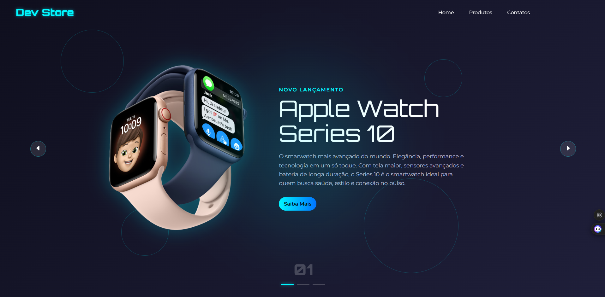

# 🛍️ Dev Store

**Dev Store** é um site estático moderno e responsivo desenvolvido com **HTML**, **CSS** e **JavaScript**, que simula uma vitrine digital para apresentação de produtos tecnológicos da Apple. O projeto destaca três itens de destaque: **Apple Watch Series 10**, **AirPods Max** e **Apple Vision Pro!**

---

## 🔗 Link do Projeto

Acesse o projeto clicando aqui: 👉 [Dev Store](https://github.com/RenatoRissato/dev-store)

---

## 🖼️ Demonstração



> Interface moderna com layout padronizado, animações suaves e carrossel funcional.

---

## 🛠️ Tecnologias Utilizadas

- **HTML5** – Estrutura da página.
- **CSS3** – Estilização avançada com layout responsivo e animações.
- **JavaScript** – Lógica do carrossel e indicadores interativos.
- **Google Fonts** – Fontes *Montserrat* e *Orbitron* para visual moderno.

---

## 📁 Estrutura do Projeto
```
dev-store/
├── img/ # Imagens dos produtos
│ ├── apple-watch.png
│ ├── air-pods.png
│ ├── vision-pro.png
├── index.html # Página principal
├── styles.css # Estilo e animações
└── scripts.js # Carrossel e lógica interativa
```

---

## 🚀 Funcionalidades

- 🎯 **Carrossel de Produtos** com transição automática e controle por setas.
- ✨ **Animações suaves** com transições de entrada para imagens e textos.
- 🔢 **Indicador numérico e visual** para destacar o item ativo.
- 📎 **Botões "Saiba Mais"** como pontos de extensão futura para links ou páginas internas.

---

## 📌 Como Executar Localmente

1. Clone este repositório:

```bash
git clone https://github.com/RenatoRissato/dev-store.git
```
Abra o arquivo `index.html` em um navegador.

## 📜 Licença
Este projeto é de código aberto e está disponível sob a licença MIT.

---

Feito com ❤️ por [Renato Rissato](https://github.com/RenatoRissato) 🚀
